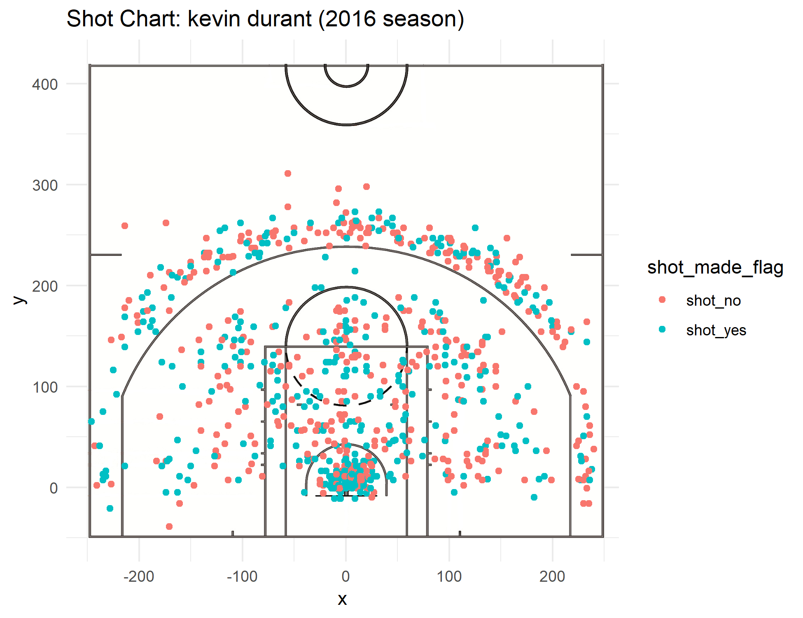
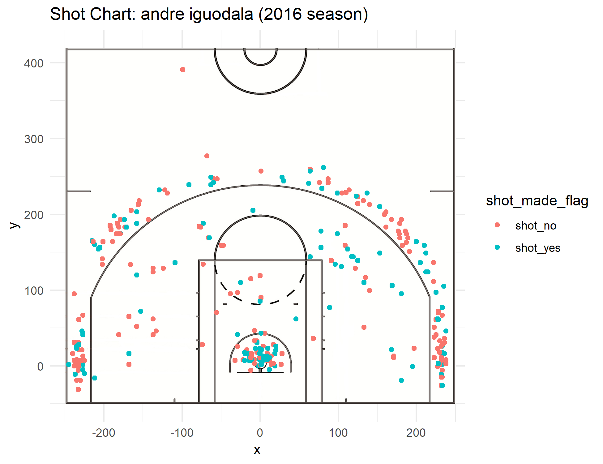
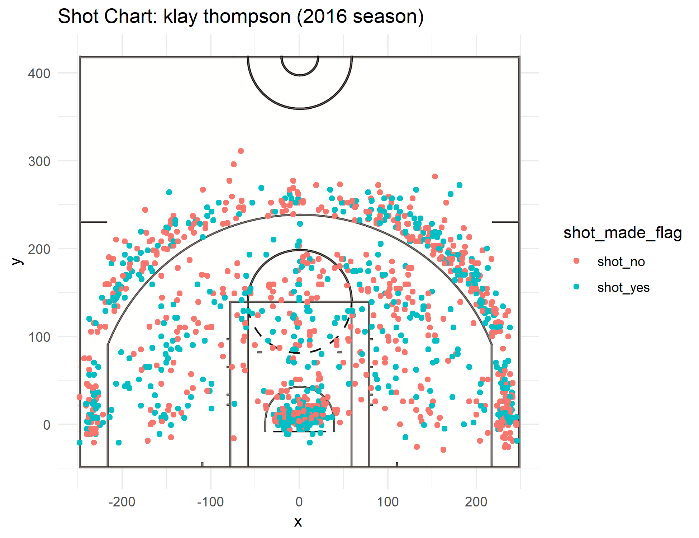
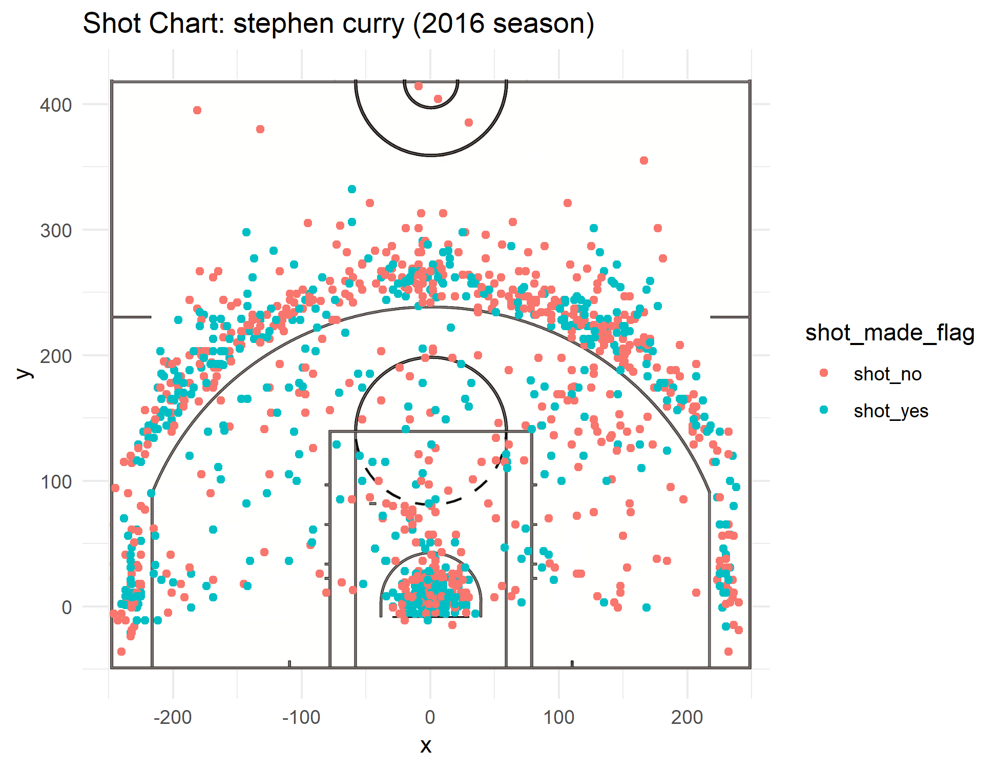
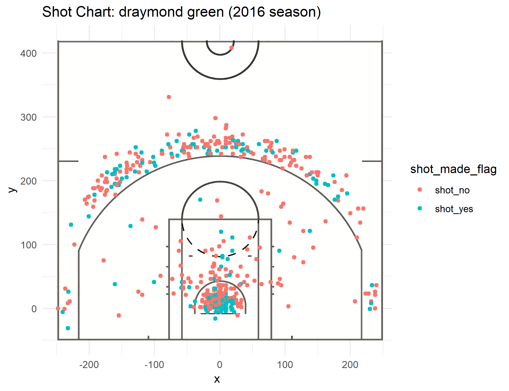

```{r setup, include=FALSE}
knitr::opts_chunk$set(echo = TRUE)
```

```{r echo=FALSE}
setwd("C:/Users/david/stat133/hw-stat133/workout01/report")
library(readr)
library(ggplot2)
library(dplyr)

effective_shooting <- read.csv(file="../data/effective_shooting_table.csv")
a_k_k <- read.csv(file="../data/kevin_klay_andre.csv")
s_d <- read.csv(file="../data/steph_draymond.csv")

```


The death lineup. Five all-star caliber players together on the same court. It's the reason why the Golden State Warriors have been so dominant as of late, but exactly makes them so lethal? They're high offensive rating means one thing for sure. They're efficient with their baskets, especially when looking at each player's effective field goal percentage. How well does effective field goal percentage track efficiency though? Is the high effective shooting percentage the reason behind the success of the Warriors?

Below are the effective shooting percentages of the deathlineup and other relevant statistics:

```{r echo=FALSE}
effective_shooting

```

Today we explore the hypothesis that shooting more two pointers increases your effective shooting percentage than shooting more three pointers. We look at our three typical players and then two outliers within the death lineup.

First let us look at three Golden State Warriors that follow this interesting trend. In this group, we have shooting guard Klay Thompson, small forward Kevin Durant, and power forward Andre Iguodala. Below is a table of their effective shooting percentages and other relevant data.

```{r echo=FALSE}
as.data.frame(a_k_k)

```


When we look at what percentage of a player's made shots are two-pointers, a trend begins to show. The more two-pointers a player makes, the higher their effective field goal percentage. To go more in depth, below is a chart of all the player's shot attempts.


```{r out.width="80%", echo = FALSE, fig.align ="center"}





```

Notice that a majority of Kevin Durant's made shots are in the midrange and paint. In fact, out of all the warriors in this group, Durant has the highest percentage of made field goals that are two pointers, with 78.78% of his shots coming from inside the three point line. Andre Iguodala's made two-pointers percentage is 69.9%, and Klay Thomson's is 57.22%. With these numbers in mind, it is clear that as more and more made shots are coming from two pointer's, a player's effective field goal percentage increases. This makes sense intuitively. The chance of making a two pointer to begin with is much easier than shooting a three, so if a player shoots more two pointers and is more likely to make twos than threes, then it should follow that his effective field goal percentage should increase.

But does every player follow this trend? For players Stephen Curry and Draymond Green, it seems that the trend is broken. Below are tables of their effective field goal percentages and their respective shot charts.

```{r echo = FALSE}
s_d

```

```{r out.width="80%", echo = FALSE, fig.align ="center"}




```

Notice how a large proportion of Steph Curry's shots are behind the 3-point arc and how a majority of Draymond Green's made shots are inside the paint. With the current trend identified previously, it should follow that because he takes a large proportion of three point shots, Steph Curry should have a lower effective field goal percentage. However, what we see is quite the opposite. Despite shooting a smaller percentage of two pointers compared to Klay Thompson (52.06% vs. 67.22%), Curry's effective shooting range is actually higher than Thompson's (57.9% vs. 57.2%). 

Similarly, except in the other direction, a large percentage of Draymond Green's shots are inside the three point arc. In fact, 69.8% of his made shots were two-pointers. Given such a high a percentage of two-pointers, one would expect Draymond Green's effective shooting percentage to fall somewhere between Iguodala's and Thompson's. However, Green's effective shooting percentage is the lowest of the five players at 48.8%. Overall, both and Steph and Draymond seem to contradict the earlier trend that was established. 

Even though the effective field goal metric is meant to place more weight on three-point field goals and emphasize their value, it is clear that two-point field goals are still the more efficient way to get buckets. In the case of Steph Curry, we see that his effective shooting percentage is higher than Klay Thompson even though more of his shots were three pointers, but how much higher was it really? Having a higher percentage of made threes by 15.16%, Curry's effective shooting percentage is only .7% higher than Klay's. Klay's three point field goal percentage may be higher than Steph's by 1.6%, but efficiency doesn't explain this phenomenon either. Curry's two-point field goal percentage is actually **higher** than Klay's by 3.6%, and yet, when looking at overall effective shooting percentages, Klay still come out on top. We see that the percentage of made field goals that are two-pointers still has a much larger impact on one's effective shooting percentage, despite the fact that effective shooting percentages are made to weigh three pointers more heavily.

One explanation for Draymond's low effective field goal percentage is his role within the death lineup. He is the main defensive the stop for the opposing man, and as an undersized center, the job can be quite physically demanding. It doesn't take long to figure out that because Draymond is using more energy on the defensive side, his offensive potential would theoretically take a hit. As his main job on the offensive end is a ball distributer anyways, it should not be a surprise that Green has a low effective shooting percentage given a combination of few shot opportunities and overexertion on the defensive end.

How accurate is effective shooting percentage in tracking the importance of three pointers? The answer is unclear.

Now that we know this trend is present in five players, can we say that this trend will be true for the rest of the league? Obviously not, but it should. A more efficient two-point field goal percentage combined with more two pointers being taken should mean a higher effective field goal percentage. But if this is not the case, then we have an interesting way of diving deeper into the success behind the death lineup. The real success behind the death lineup is not their small ball defense or their potent three-point onslaught, but the efficiency of their two-pointers. A player's effective shooting percentage is mainly determined by how many two-point field goals they make rather than their three-point field goals made. Everyone describes the league today as a three-point shooting game. If your team can't shoot the three well, you won't win games, but what we see hear is a contradiction. The most efficient way to get buckets is still the midrange and paint. Is it possible that we will see the return of the midrange soon? Will we see more post up plays? It's hard to tell, but don't be surprised if this trend continues.


