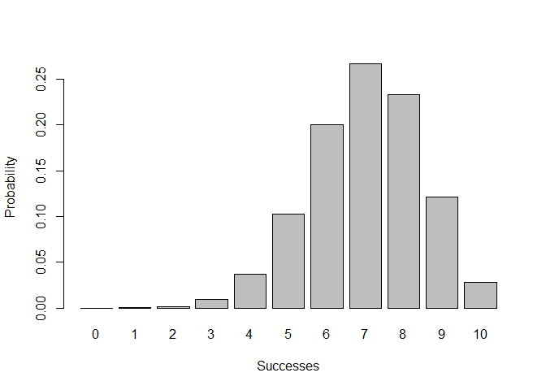
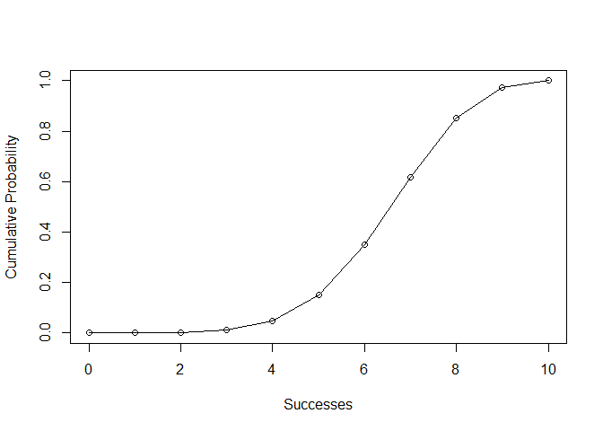

Overview
--------

"'Binomial'" is a package that provides functions to simulate a binomial distribution

-   `bin_choose(n, k)` calculates n choose k
-   `bin_probability(s, t, p)` finds the probability of s successes in t trials with each success occuring with probability p
-   `bin_distribution(t,p)` creates an object with class "bindis" that is a PMF for a binomial distribution with t trials and p probability for success.
-   `bin_cumulative(t,p)` creates and object with class "bincum" that is a CDF for a binomial distribution with t trials and p probability for success.
-   `plot()` method for a `bindis` or 'bincum' object that graphs the distribution.
-   `bin_variable(t, p)` creates an object with class "binvar" with attributes "trials" with value t and "prob" with value p
-   `summary()` method for a "binvar" object that gives key metrics for a given binomial random variable
-   `bin_mean(t, p)` finds the mean of a binomial distribution with trials t and probability p
-   `bin_variance(t, p)` finds the variance of a binomial distribution with trials t and probability p
-   `bin_mode(t, p)` finds the mode of a binomial distribution with trials t and probability p
-   `bin_skewness(t, p)` finds the skewness of a binomial distribution with trials t and probability p
-   `bin_kurtosis(t, p)` finds the kurtosis of a binomial distribution with trials t and probability p

Motivation
----------

This package has been developed to make working with Binomial Distributions in R more convenient

Usage
-----

``` r
library(Binomial)

# 5 choose 3
bin_choose(5,3)
#> [1] 10

#Probability of 5 successes in 8 trials with probability of each success being .8
bin_probability(5, 8, .8)
#> [1] 0.1468006

#Create "bindis" and "bincum" objects with 10 trials and .7 probability of success
p <- bin_distribution(10, .7)
head(p)
#> $success
#>  [1]  0  1  2  3  4  5  6  7  8  9 10
#> 
#> $probability
#>  [1] 0.0000059049 0.0001377810 0.0014467005 0.0090016920 0.0367569090
#>  [6] 0.1029193452 0.2001209490 0.2668279320 0.2334744405 0.1210608210
#> [11] 0.0282475249

c <- bin_cumulative(10, .7)
head(c)
#> $success
#>  [1]  0  1  2  3  4  5  6  7  8  9 10
#> 
#> $probability
#>  [1] 0.0000059049 0.0001377810 0.0014467005 0.0090016920 0.0367569090
#>  [6] 0.1029193452 0.2001209490 0.2668279320 0.2334744405 0.1210608210
#> [11] 0.0282475249
#> 
#> $cumulative
#>  [1] 0.0000059049 0.0001436859 0.0015903864 0.0105920784 0.0473489874
#>  [6] 0.1502683326 0.3503892816 0.6172172136 0.8506916541 0.9717524751
#> [11] 1.0000000000

#plotting "bindis" and "bincum" objects
plot(p)
```



``` r
plot(c)
```



``` r

#Create a "binvar" object with 20 trials and .8 probability of success
bin <- bin_variable(20, .8) 
bin
#>   'Binomial variable' 
#> 
#>   Parameters 
#>  - number of trials: 20 
#>  - prob of success: 0.8

#summary statistics of "binvar" object
summary(bin)
#>   'Binomial variable' 
#> 
#>   Parameters 
#>  - number of trials: 20 
#>  - prob of success: 0.8 
#> 
#> Measures 
#>  - mean: 16 
#>  - variance: 3.2 
#>  - mode: 16 
#>  - skewness: -0.3354102 
#>  - kurtosis: 0.0125

#measures of a binomial distribution with 7 trials and .2 probability of success

bin_mean(7, .2)
#> [1] 1.4
bin_variance(7, .2)
#> [1] 1.12
bin_mode(7, .2)
#> [1] 1
bin_skewness(7, .2)
#> [1] 0.5669467
bin_kurtosis(7, .2)
#> [1] 0.03571429
```
